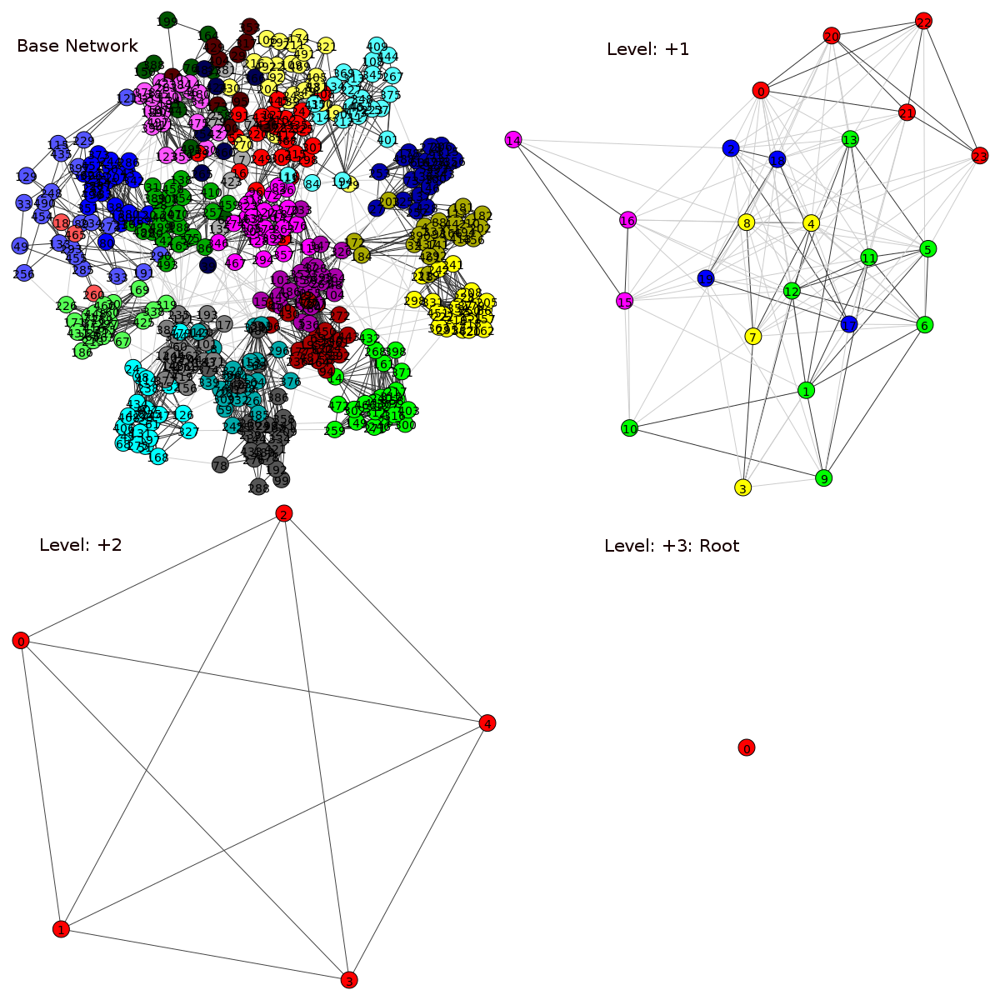

# ProjectX: The C`ore


## About

ProjectX is part of a larger project. This project aims at detecting clusters in a citation network, abstracting and visualizing them. Basic flow of the process is as follows:  

* Parsing and loading the citation network  
* Detecting the initial communities in the citation network  
* Further dividing initially detected communities until maximum desired community size for each community is reached  
* Abstracting, i.e. collapsing communities into a single node while preserving the citation relationship against the other communities  
* Detecting communities in the collapsed network and recursively continuing the abstraction process until a single community i.e. Root node is left  
* Deploying the paper and community objects, parent/child relationships and interconnectedness related information to a database  

Every paper and community object is assigned with a _pagerank_ value and links between communities on the same level have their _weight_ attribute.

Programming language chosen: _Python 2.7.x_  
Database chosen: _NEO4J_   
Graph related operations via: _igraph-python_   
Community detection algorithm used: _[Finding community structure in very large networks](https://arxiv.org/pdf/cond-mat/0408187.pdf)_  
Code is proven to work on _Ubuntu Linux_ and _OSX_.  

## Citation Data

So far, we are using the dirnetgen.py (directed network generator) script to generate our paper network. It creates the hierarchical network of  desired size and parameters. 
These parameters can be modified through network.param file and a new data file with modified parameters can be generated by running the dirnetgen.py. The downloaded package 
comes with a sample dataset of 500 entries. This script generates a network structure and stores results in a json file called data.json and adds paper id, title, keywords, 
authors, metadata, date and reference related information accordingly. The generated network and the corresponding field data are designed to represent the reality as much 
as possible. The Team is currently working on the acquiring real citation data.

## How to run?
Before running any code, make sure that you have the followings installed:  

* Python: [matplotlib, scipy, numpy, igraph]  
* NEO4J: installed, configured [username=neo4j / password=test / ports=default values] and the status is active.  
Now the code can be run.

#### Options

* __python main.py -f data.json 500__  
> `-f` argument takes the data file name i.e. data.json, which is the json file generated by dirnetgen.py. 
500 is the number of entries in the json file.

* __python main.py -f data.json 500 -nodraw__  
> `-nodraw` argument will suppress the igraph figures showing up on the screen, recommended if the data size is large. Otherwise, figures that pop-up give you the useful insights about the detected
communities.

* __python main.py -f data.json -limit 30__  
> `-limit` argument is the maximum desired community size per community. If the size of a community is bigger than this value after initial community detection, then the community will undergo another
division process until its size falls below the desired size. Here, the size refers to the number of entities i.e. paper or community objects, a community holds inside.

* __python main.py -f data.json > logger.txt__  
> `>logger.txt` argument will create the logger.txt file and transfer the screen printings into that file rather than showing them up on the terminal screen.  


## Where are the Results?  
* Results are stored into the database. Log in and explore your database.  
* Structure of the paper object in the database: ``` fields: {id, title, keywords, authors, date, references, metadata, pagerank } ```  
* Structure of the community object in the database: ``` fields: {id, level, pagerank } ```  
* Communities are labeled with their level numbers. Highest level is the root level.  
* Query for the root level and then explore its relationships with the children communities until the bottom level with the paper objects is reached.  

Besides the database, main.py also generates the levels.txt and statistics.txt files.  

* _levels.txt_:
This file shows the leveling of the citation network in conjunction with its size i.e. number of communities it holds, as a result of the community detection and abstraction process. Negative levels show the further division of the initial level due to the -limit option. The most negative level is the base community level and the abstraction process starts from there up to the most positive level, which is the root level. The database holds only the initial level (if -limit option is omitted) or the base level (if -limit is provided) and all of the positive levels i.e. abstractions, which are of the interest to us.

* _statistics.txt_: 
This file shows the original dataset/graph properties e.g. total node number, edge number, min/max in and out degrees, average degrees for both directed and undirected graphs. Furthermore, it also tells you about  the properties of the detected initial communities, and the base communities if different. The statistical measures also include: Modularity factor, detected community number, and min/max/average community size.

## File System
__Python files__: 

* main.py  
* parser.py  
* database.py  
* summary.py  
* dirnetgen.py  

__Input files__:  

* data.json -> main.py   
* network.param -> dirnetgen.py    

__Output files__:  

* levels.txt <- main.py  
* statistics.txt <- main.py  
* logger.txt <- main.py  
* data.json <- dirnetgen.py  
* network.stat <- dirnetgen.py  
* community_assignment.dat <- dirnetgen.py  
* links.dat <- dirnetgen.py  


## Notes on the Citation dataset
The graph representing the citation network must have the following properties:

* no self-loops  
* no multi-edges  
* no isolated nodes  

